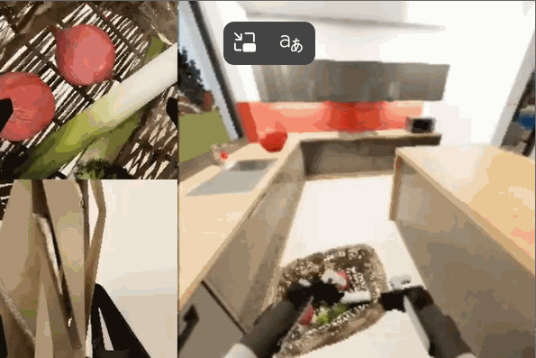
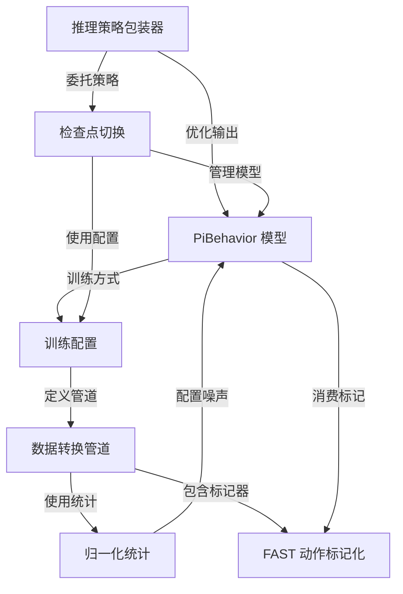
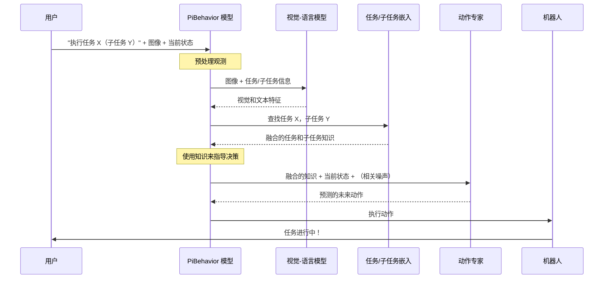

link: [IliaLarchenko/behavior-1k-solution: 1st place solution of 2025 BEHAVIOR Challenge](https://github.com/IliaLarchenko/behavior-1k-solution)

# docs：behavior-1k-solution

`behavior-1k-solution` 项目旨在使用 **PiBehavior 模型**（一种视觉-语言-动作 AI）构建*智能机器人大脑*。



处理机器人观测数据以预测动作，采用`数据转换管道`进行输入准备，并使用`推理策略包装器`实现*鲁棒的真实世界控制*。系统可以动态地`在专用 AI 模型之间切换`以完成不同任务，确保在各种机器人行为中实现最佳性能。


## 可视化



## 章节

1. [PiBehavior 模型
](01_pibehavior_model_.md)
2. [检查点切换
](02_checkpoint_switching_.md)
3. [推理策略包装器
](03_inference_policy_wrapper_.md)
4. [数据转换管道
](04_data_transformation_pipeline_.md)
5. [FAST 动作标记化
](05_fast_action_tokenization_.md)
6. [归一化统计
](06_normalization_statistics_.md)
7. [训练配置
](07_training_configuration_.md)

---

# 第 1 章：PiBehavior 模型

想象一下我们有一个智能机器人，我们希望它执行复杂的家务，比如准备一顿饭或整理房间。这个机器人如何知道接下来该做什么？它如何理解我们的指令，观察周围的世界，然后决定其手臂和抓手的正确动作？

答案在于它的"大脑"，对于 `behavior-1k-solution` 项目来说，这个大脑就是 **PiBehavior 模型**。该模型是核心智能，使我们的机器人能够在现实世界中感知、理解和行动。可以将其视为机器人的完整决策系统。

## 什么是 PiBehavior 模型？

从本质上讲，PiBehavior 模型是一种特殊的人工智能，称为==**视觉-语言-动作（VLA）模型**==。这意味着它可以：

*   **看到**世界（视觉）：它处理来自机器人摄像头的图像。
*   **理解**任务（语言）：它接收文本指令或高级目标。
*   **在世界中行动**（动作）：它为机器人的关节和底座生成一系列动作。

它建立在一个名为"Pi0.5"的强大基础之上，该基础专为稳健和灵活的行为生成而设计。

### 使其智能的关键特性

PiBehavior 模型不仅仅是一个基本的 VLA 模型；它包含几个专门的特性，使其在复杂任务中极其有效：

1.  **可训练的任务嵌入**：
    *   **类比**：想象我们为每个任务都有一个备忘单。当机器人需要执行"堆叠积木"时，它会查找其"堆叠积木"备忘单。==该备忘单包含有关任务的学习信息==，帮助它快速掌握具体细节。
    *   **在代码中**：这由 `PiBehavior` 类中的 `self.task_embeddings` 表示（参见 `src/b1k/models/pi_behavior.py`）。这是一个查找表，其中每个任务 ID（如任务 0、任务 1 等）都有其自己独特的、学习到的数值表示（嵌入）。

2.  **子任务状态融合**：
    *   **类比**：许多复杂任务只是一系列较小的步骤。例如，"倒水"可能涉及"抓住水壶"，然后"倾斜水壶"，然后"放回水壶"。机器人需要知道*它当前处于哪个步骤*。子任务状态融合帮助模型理解其在更大任务中的当前进度。
    *   **在代码中**：模型将 `subtask_state`（例如，阶段 0、阶段 1 等）作为输入。然后它 `fuse_task_and_subtask`（`PiBehavior` 中的一个方法）将整体任务知识与其当前子任务进度相结合，为决策创建更明智的上下文。

3.  **相关噪声以实现稳健行为**：
    *   **类比**：当我们伸手去拿杯子时，我们的手臂关节不会完全独立地移动；它们以协调、流畅的方式移动。"相关噪声"帮助机器人生成类似自然和协调的动作，而不是生硬或机械的动作。它使预测的动作对小的不确定性更加稳健。
    *   **在代码中**：`PiBehaviorConfig` 中的 `use_correlated_noise` 设置（参见 `src/b1k/models/pi_behavior_config.py`）启用了此功能。模型学习机器人不同部分运动之间的关系（例如，肘关节运动如何与腕关节运动相关），并使用这些关系生成更平滑的动作序列。

## 如何使用 PiBehavior 模型

要使用 PiBehavior 模型，我们通常遵循以下步骤：

1.  **定义配置**：使用 `PiBehaviorConfig` 设置我们希望 PiBehavior 模型的行为方式。这指定了诸如机器人的动作维度、任务数量以及是否使用相关噪声等细节。
2.  **创建模型**：使用配置实例化 `PiBehavior` 模型。
3.  **加载归一化统计**：这些统计数据对于相关噪声和正确的数据缩放等任务至关重要，它们被加载到模型中。
4.  **提供观测**：向模型提供当前传感器读数（如摄像头图像、机器人关节位置）和任务目标。
5.  **采样动作**：要求模型预测下一个动作序列。

让我们看一些代码。

### 1. 定义配置

首先，我们创建一个配置对象。这告诉模型要设置什么样的"大脑"。

```python
from b1k.models.pi_behavior_config import PiBehaviorConfig

# 创建基本配置
config = PiBehaviorConfig(
    action_dim=32,       # 机器人的动作有 32 个维度（例如，关节角度、抓手状态）
    action_horizon=30,   # 预测 30 个未来动作
    num_tasks=50,        # 模型在 50 个不同任务上训练
    use_correlated_noise=True, # 使用相关噪声以实现更平滑的动作
)

print(f"模型配置为 {config.num_tasks} 个任务，具有 {config.action_dim} 个动作维度。")
```
此代码创建了一个 `PiBehaviorConfig` 对象，它就像我们机器人大脑的蓝图

它指定了基本参数，如其动作有多少个维度以及它应该预测多少个未来步骤。

### 2. 创建模型

配置准备好后，我们现在可以创建 `PiBehavior` 模型的实例。

```python
import jax
import flax.nnx as nnx
from b1k.models.pi_behavior import PiBehavior

# 为模型初始化创建随机密钥
rng_key = jax.random.PRNGKey(0)

# 创建 PiBehavior 模型实例
model = PiBehavior(config, rngs=nnx.Rngs(rng_key))

print("PiBehavior 模型已初始化！")
```
在这里，我们初始化 `PiBehavior` 模型。`rng_key` 用于模型设置期间的内部随机过程，如初始化其内部"知识"（权重）。

### 3. 加载归一化统计

如果我们启用 `use_correlated_noise`（强烈建议用于真实的机器人运动），我们需要加载预先计算的归一化统计数据。这些统计数据包括指导"相关噪声"的相关矩阵。

```python
# 在实际场景中，我们会从文件中加载这些数据。
# 对于此示例，我们将创建一个虚拟结构。
dummy_norm_stats = {
    'actions': {
        'action_correlation_cholesky': jax.numpy.eye(config.action_horizon * config.action_dim)
        # 在实践中，这将是一个完整的、学习到的 Cholesky 矩阵
    }
}

# 将相关矩阵加载到模型中
model.load_correlation_matrix(dummy_norm_stats)

print("归一化统计数据（包括相关矩阵）已加载。")
```
`load_correlation_matrix` 方法至关重要。它告诉模型不同动作的"运动风格"，使其能够生成更自然和协调的动作序列。在实际应用中，`dummy_norm_stats` 将从文件中加载（我们将在[归一化统计](06_normalization_statistics_.md)中讨论）。

### 4. 提供观测和采样动作

最后，我们向机器人提供其环境和任务的观测，模型将生成动作。

```python
from b1k.models.observation import Observation
import jax.numpy as jnp

# --- 示例观测 ---
# （在真实机器人中，这些将来自传感器）
dummy_obs = Observation(
    images={
        "base_0_rgb": jnp.zeros((1, 224, 224, 3), dtype=jnp.float32),
        "left_wrist_0_rgb": jnp.zeros((1, 224, 224, 3), dtype=jnp.float32),
        "right_wrist_0_rgb": jnp.zeros((1, 224, 224, 3), dtype=jnp.float32),
    },
    image_masks={
        "base_0_rgb": jnp.array([True]),
        "left_wrist_0_rgb": jnp.array([True]),
        "right_wrist_0_rgb": jnp.array([True]),
    },
    state=jnp.zeros((1, config.action_dim), dtype=jnp.float32), # 当前机器人关节状态
    # tokenized_prompt 包含 [task_id, subtask_state]
    tokenized_prompt=jnp.array([[5, 2]], dtype=jnp.int32), # 任务 5，子任务 2
    tokenized_prompt_mask=jnp.array([[True, True]], dtype=jnp.bool_),
    fast_tokens=None, # FAST 令牌仅在训练期间使用，不在推理期间使用
    fast_token_mask=None,
)

# 生成动作
rng_actions = jax.random.PRNGKey(1)
predicted_actions, subtask_logits = model.sample_actions(rng_actions, dummy_obs)

print(f"生成的动作形状：{predicted_actions.shape}")
# 输出 `predicted_actions` 将是 30 个未来动作的序列，
# 每个动作有 32 个维度，供机器人执行。
# `subtask_logits` 给出关于下一个子任务状态的预测。
```
此代码片段展示了如何将 `Observation` 传递给 `sample_actions` 方法。

这里的 `tokenized_prompt` 至关重要；它指定了 `task_id`（例如，"倒水"）和 `subtask_state`（例如，"倾斜水壶"）。模型使用所有这些信息输出 `predicted_actions`，这是机器人的下一个计划动作。

## 底层原理：PiBehavior 如何工作

让我们简化 PiBehavior 模型内部的复杂流程。当我们要求它 `sample_actions` 时



### 代码组件

让我们查看一些代码文件，看看这些概念在哪里。

#### `src/b1k/models/pi_behavior_config.py`

此文件定义了 `PiBehaviorConfig`，它保存模型的所有可调设置。

```python
# 来自 src/b1k/models/pi_behavior_config.py 的代码片段
@dataclasses.dataclass(frozen=True)
class PiBehaviorConfig(_model.BaseModelConfig):
    # ... 其他配置选项 ...
    num_tasks: int = 50
    task_embedding_dim: int = None
    max_num_subtask_states: int = MAX_NUM_STAGES # 所有任务中的最大阶段数
    use_correlated_noise: bool = True
    correlation_beta: float = 0.5 # 相关性的收缩参数
    subtask_loss_weight: float = 0.1 # 强调子任务预测
    # ... 更多配置选项 ...
```
在这里，`num_tasks` 决定了机器人有多少个不同的任务备忘单。`max_num_subtask_states` 设置任何任务可以拥有的最大步骤数。`use_correlated_noise` 和 `correlation_beta` 控制机器人如何生成流畅、协调的动作。

#### `src/b1k/models/pi_behavior.py`

这是定义 `PiBehavior` 模型的主文件。

1.  **模型初始化（`__init__`）**：
    模型设置其核心组件：

    ```python
    # 来自 src/b1k/models/pi_behavior.py 的代码片段
    class PiBehavior(_model.BaseModel):
        def __init__(self, config: pi_behavior_config.PiBehaviorConfig, rngs: nnx.Rngs):
            super().__init__(config.action_dim, config.action_horizon, config.max_token_len)
            self.config = config
    
            # 视觉-语言模型骨干（像"眼睛和耳朵"）
            self.PaliGemma = nnx.Dict(llm=llm, img=img)
    
            # 任务嵌入表（"备忘单"）
            self.task_embeddings = nnx.Embed(
                num_embeddings=config.num_tasks, features=config.task_embedding_dim, rngs=rngs,
            )
    
            # 子任务融合组件（用于理解"我在哪个步骤？"）
            self.task_stage_embeddings = nnx.Embed(
                num_embeddings=TOTAL_TASK_STAGE_EMBEDDINGS, features=self.subtask_encoding_dim, rngs=rngs,
            )
            # ... 门控融合层 ...
    ```
    `self.PaliGemma` 是处理图像和一般文本的强大视觉-语言模型。`self.task_embeddings` 存储每个任务的唯一表示。`self.task_stage_embeddings` 和相关的 `gate` 和 `fusion` 层负责理解机器人当前正在执行哪个子任务以及如何将其与整体任务知识相结合。

2.  **融合任务和子任务信息（`fuse_task_and_subtask`）**：
    此方法采用一般任务理解并将其与当前子任务步骤相结合。

    ```python
    # 来自 src/b1k/models/pi_behavior.py 的代码片段
    def fuse_task_and_subtask(
        self, task_embedding: at.Float[at.Array, "b d"], task_ids: at.Int[at.Array, " b"], subtask_state: at.Int[at.Array, " b"]
    ) -> at.Float[at.Array, "b n d"]:
        # ... 计算 'sincos_encoding'（子任务的类时间编码）...
        # ... 查找特定阶段的 'task_stage_embedding' ...
        
        # 组合所有输入（task_embedding、sincos_encoding、task_stage_embedding）
        all_inputs = jnp.concatenate([task_embedding, sincos_encoding, task_stage_embedding], axis=-1)
        
        # 使用学习到的 'gates' 和 'fusion layers' 智能地混合这些信号
        # ... （门控和融合网络调用）...
        
        # 返回多个融合表示以提供丰富性
        fused_embeddings = jnp.stack([task_gated, balanced_fusion, stage_dominant, pure_stage], axis=1)
        return fused_embeddings
    ```
    这个函数是"子任务状态融合"魔法发生的地方。它采用抽象的 `task_embedding` 和 `subtask_state`（例如，"5 个步骤中的第 2 步"），创建丰富的表示，然后使用小型神经网络（`gate_sincos`、`fusion_layer1` 等）智能地将它们组合成全面的理解。输出不仅仅是一个组合向量，而是*多个*不同条件的向量，为模型提供了任务和子任务的细致视图。

3.  **加载相关矩阵（`load_correlation_matrix`）**：
    此方法在模型初始化*之后*调用，通常在加载预先计算的归一化统计数据时。

    ```python
    # 来自 src/b1k/models/pi_behavior.py 的代码片段
    def load_correlation_matrix(self, norm_stats: dict):
        if not self.use_correlated_noise:
            logger.info("相关噪声已禁用，跳过加载")
            return
        
        actions_stats = norm_stats['actions']
        chol_matrix = actions_stats.get('action_correlation_cholesky')
        
        # 重建协方差并应用收缩正则化
        Sigma = jnp.array(chol_matrix) @ jnp.array(chol_matrix).T
        Sigma_reg = self.correlation_beta * Sigma + (1 - self.correlation_beta) * jnp.eye(Sigma.shape[0])
        L_reg = jnp.linalg.cholesky(Sigma_reg) # 正则化矩阵的 Cholesky 分解
        
        self.action_correlation_cholesky.value = L_reg
        self.correlation_loaded = True
    ```
    此函数获取原始相关数据（通常存储为 Cholesky 分解）并对其进行处理。它使用 `correlation_beta` 应用一种称为"收缩正则化"的技术。这使得相关噪声生成更加稳健，如果原始相关数据有噪声，可以防止不稳定性。结果 `L_reg` 然后被存储并用于 `generate_correlated_noise`。

**任务嵌入**：将每个具体任务（如"拿杯子"）编码成一个可学习的向量，让模型直接=="记住"任务特征==，而不是通过语言模型理解文字描述。

**子任务融合**：将一个复杂任务拆分成多个阶段（如"走近→抓取→放置"），模型通过融合当前阶段信息来决定该做什么动作，类似于==给机器人提供"进度条提示"==。

> **sum**：任务嵌入像是给每个任务分配一个专属ID卡，子任务融合像是在ID卡上标注"当前执行到第几步"，让模型既知道总目标又知道当前进度。

## 结论

==PiBehavior 模型是机器人执行任务能力背后的复杂"大脑"==。

巧妙地`结合了机器人所看到的、一般任务知识和特定子任务进度，以生成平滑、协调的动作`。

理解其==配置、如何提供观测以及其核心内部机制（如任务嵌入和子任务融合==），我们已经在理解 `behavior-1k-solution` 项目方面迈出了关键的第一步。

接下来，我们将在[检查点切换](02_checkpoint_switching_.md)章节中探讨如何==管理和在这个大脑的不同版本之间切换==

