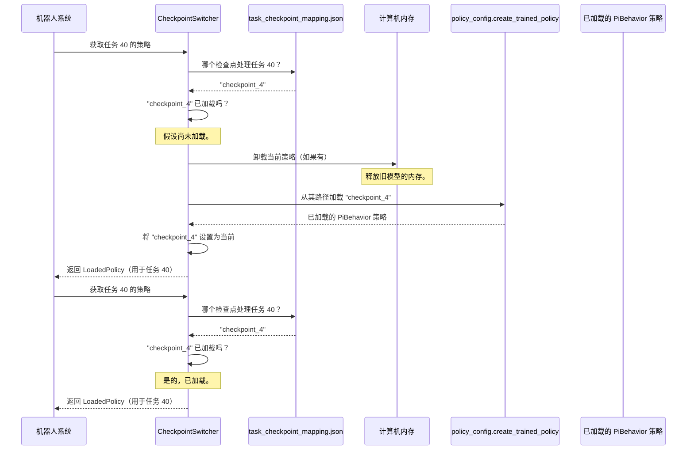

# 第 2 章：检查点切换

在[第 1 章：PiBehavior 模型](01_pibehavior_model_.md)中，我们了解了 PiBehavior 模型，这个使我们的机器人能够理解任务并生成动作的"大脑"

想象一下这个大脑非常聪明，但即使是最聪明的大脑也不可能在*所有事情*上都是专家。

为了让机器人处理各种各样的任务——比如冲咖啡、叠衣服或整理桌子——拥有几个专门的"大脑"可能会更高效，每个大脑都特别擅长某些类型的任务。可以把它想象成一个专家团队：一个专家负责厨房任务，另一个负责清洁，等等。

但如果我们的机器人有多个大脑，它如何知道*哪个*大脑用于当前任务？这就是**检查点切换**的用武之地

## 什么是检查点切换？

检查点切换就像为我们机器人的"大脑"模型配备了一个有用的**图书管理员**。当机器人被分配一个新任务时，这个图书管理员会自动：

1.  **识别**最适合的专门"大脑"（我们称之为**检查点**）。
2.  **加载**该特定检查点到机器人的活动内存中。
3.  **卸载**之前的检查点以节省宝贵的计算机资源。

这个巧妙的系统允许机器人动态地调整其"专业知识"以适应它需要执行的任何任务，而无需一次性加载*所有*知识。

### 概念

*   **专用模型（检查点）**：这些是我们[PiBehavior 模型](01_pibehavior_model_.md)的不同版本，每个版本都经过训练以在特定任务集上表现出色。例如，一个检查点可能擅长所有"倾倒"任务，而另一个则精通"抓取"任务。
*   **任务映射**：这是一个简单的"备忘单"或查找表，明确说明哪些任务由哪个检查点处理。我们的图书管理员使用这个映射来决定加载哪个大脑。
*   **动态加载/卸载**：这是在需要时加载新模型并移除旧模型的过程。这很关键，因为这些 AI 模型可能非常大并且消耗大量计算机内存，尤其是在机器人上。

## 如何使用检查点切换

处理所有这些切换魔法的主要组件称为 `CheckpointSwitcher`。它的设计使用起来很简单：我们只需告诉它机器人需要做什么任务，它就会给我们正确的策略（加载的"大脑"）来执行该任务。

让我们看看它是如何工作的，从它使用的"备忘单"开始。

### 1. 任务映射文件（`task_checkpoint_mapping.json`）

首先，我们需要告诉 `CheckpointSwitcher` 哪些任务属于哪个专用模型。这是通过一个 JSON 文件完成的。

```json
{
  "checkpoints": {
    "checkpoint_4": {
      "path": "~/models/checkpoint_4",
      "tasks": [40]
    },
    "checkpoint_3": {
      "path": "~/models/checkpoint_3",
      "tasks": [32,46,27,38,39,31, 35,37,33,4,36,49,41]
    },
    "checkpoint_2": {
      "path": "~/models/checkpoint_2",
      "tasks": [1,45,0,16,12,9,18,20,21,22,30,7,8, 17, 26, 43]
    },
    "checkpoint_1": {
      "path": "~/models/checkpoint_1",
      "tasks": [2, 3, 5, 6, 10, 11, 13, 14, 15, 19, 23, 24, 25, 28, 29, 34, 42, 44, 47, 48]
    }
  }
}
```
此文件（`task_checkpoint_mapping.json`）列出了几个检查点（例如，`checkpoint_1`、`checkpoint_2`）。每个检查点都有一个 `path`（模型文件在计算机上的位置）和一个 `tasks` 列表（由 `task_id` 数字表示，从 0 到 49），它是这些任务的专家。例如，`checkpoint_4` 专门用于 `task_id 40`。

### 2. 初始化检查点切换器

要开始使用我们的图书管理员，我们首先需要创建一个 `CheckpointSwitcher` 实例。

```python
from b1k.policies.checkpoint_switcher import CheckpointSwitcher
from b1k.training import config as _config

# 加载整体训练配置（模型的蓝图）
# 这个 'config' 对象告诉我们 PiBehavior 模型的一般属性。
training_config = _config.get_config("configs/b1k_base_config.py")

# 创建 CheckpointSwitcher 实例
# 它需要我们映射文件的路径和 training_config。
switcher = CheckpointSwitcher(
    config_path="task_checkpoint_mapping.json", # 我们的备忘单文件
    training_config=training_config,
    sample_kwargs={"num_steps": 20} # 动作采样方式的设置
)

print("检查点切换器已准备就绪！")
```
在这里，我们初始化 `CheckpointSwitcher`。它读取我们的 `task_checkpoint_mapping.json` 文件来构建其内部映射。`training_config` 提供了它可能加载的任何[PiBehavior 模型](01_pibehavior_model_.md)的一般结构。

### 3. 获取任务的策略

现在，每当机器人需要执行任务时，我们只需向 `CheckpointSwitcher` 请求正确的"大脑"。

```python
# 假设机器人需要执行 task_id 40
task_to_perform = 40

# 向切换器请求此任务的策略（加载的模型）
current_policy = switcher.get_policy_for_task(task_to_perform)

print(f"为任务 {task_to_perform} 加载的策略：{type(current_policy.model)}")

# 如果我们随后请求由同一检查点处理的任务，速度很快：
task_handled_by_same_checkpoint = 40
policy_again = switcher.get_policy_for_task(task_handled_by_same_checkpoint)
print(f"任务 {task_handled_by_same_checkpoint} 的策略（已加载）：{type(policy_again.model)}")

# 如果我们随后请求由不同检查点处理的任务：
task_to_perform_next = 32 # 此任务由 checkpoint_3 处理
print(f"现在请求任务 {task_to_perform_next} 的策略...")
new_policy = switcher.get_policy_for_task(task_to_perform_next)
print(f"切换到任务 {task_to_perform_next} 的策略：{type(new_policy.model)}")
```
在此示例中，当调用 `get_policy_for_task(40)` 时，`CheckpointSwitcher` 查找其映射，发现 `task_id 40` 由 `checkpoint_4` 处理，加载 `checkpoint_4`，并返回它。如果我们再次请求 `task_id 40`，它已经加载，所以它只是非常快速地返回相同的。但是当我们请求 `task_id 32`（属于 `checkpoint_3`）时，切换器*卸载* `checkpoint_4` 并*加载* `checkpoint_3`。

这是允许 `serve_b1k.py` 脚本根据接收到的任务无缝切换专业知识的核心功能。

## 底层原理：检查点切换如何工作

让我们窥探幕后，了解我们的"图书管理员"如何施展魔法。

### 切换过程

当调用 `CheckpointSwitcher.get_policy_for_task()` 时，会发生以下情况：



### 代码组件

检查点切换的主要逻辑位于 `src/b1k/policies/checkpoint_switcher.py` 中。

#### `src/b1k/policies/checkpoint_switcher.py`

1.  **初始化（`__init__`）**：
    当我们创建 `CheckpointSwitcher` 对象时，它首先加载 `task_checkpoint_mapping.json` 文件。

    ```python
    # 来自 src/b1k/policies/checkpoint_switcher.py 的代码片段
    class CheckpointSwitcher:
        def __init__(self, config_path: str, training_config: "TrainConfig", sample_kwargs: dict[str, Any] | None = None):
            self.config_path = config_path
            self.training_config = training_config
            self.sample_kwargs = sample_kwargs or {}
            
            self.task_to_checkpoint: dict[int, str] = {} # 例如，{40: "checkpoint_4"}
            self.checkpoint_paths: dict[str, str] = {}   # 例如，{"checkpoint_4": "~/models/checkpoint_4"}
            
            self.current_policy: _policy.Policy | None = None
            self.current_checkpoint_name: str | None = None
            
            self._load_mapping() # 此方法读取 JSON 文件
            self._validate_all_tasks_covered() # 确保所有任务 0-49 都已映射
            # ...
    ```
    `__init__` 方法通过读取我们的 `task_checkpoint_mapping.json` 来设置 `task_to_checkpoint` 字典。这个字典允许它快速找到任何给定 `task_id` 的正确检查点名称。它还将 `current_policy` 和 `current_checkpoint_name` 初始化为 `None`，因为尚未加载任何策略。`_validate_all_tasks_covered()` 方法是一个保障措施，以确保我们没有忘记将任何任务分配给检查点。

2.  **获取策略（`get_policy_for_task`）**：
    这是切换器的核心，包含加载和卸载的逻辑。

    ```python
    # 来自 src/b1k/policies/checkpoint_switcher.py 的代码片段
    def get_policy_for_task(self, task_id: int) -> _policy.Policy:
        target_checkpoint = self.get_checkpoint_for_task(task_id) # 查找检查点名称
    
        # 1. 正确的检查点已经加载了吗？
        if self.current_checkpoint_name == target_checkpoint and self.current_policy is not None:
            logging.debug(f"任务 {task_id} 使用已加载的检查点 '{target_checkpoint}'")
            return self.current_policy # 如果是，立即返回它
    
        # 2. 如果没有，我们需要切换。
        logging.info(f"任务 {task_id} 需要检查点 '{target_checkpoint}'")
    
        # 3. 卸载当前策略以释放内存。
        if self.current_policy is not None:
            logging.info(f"卸载检查点 '{self.current_checkpoint_name}'")
            del self.current_policy # 删除 Python 对象
            self.current_policy = None
            gc.collect() # 强制 Python 的垃圾回收
            
            try: # 清除 JAX 的内部缓存和 GPU 内存
                import jax
                jax.clear_caches()
                logging.info("已清除 JAX 缓存和设备内存")
            except Exception as e:
                logging.warning(f"无法清除 JAX 缓存：{e}")
    
        # 4. 加载新检查点。
        checkpoint_path = self.checkpoint_paths[target_checkpoint]
        logging.info(f"从以下位置加载检查点：{checkpoint_path}")
        
        self.current_policy = _policy_config.create_trained_policy( # 调用函数加载模型
            self.training_config,
            checkpoint_path,
            sample_kwargs=self.sample_kwargs
        )
        self.current_checkpoint_name = target_checkpoint # 更新当前加载的内容
        logging.info(f"成功加载检查点 '{target_checkpoint}'")
        
        return self.current_policy
    ```
    `get_policy_for_task` 方法是核心。它首先检查所需的检查点是否*已经*加载。如果是，这是一个非常快速的返回。如果不是，它优雅地卸载当前活动的策略（使用 `del`、`gc.collect()` 和 `jax.clear_caches()` 来确保内存被正确释放，这对于大型 AI 模型尤其重要）。然后，它调用 `_policy_config.create_trained_policy`（我们接下来会看到）从其文件路径加载新的专用模型，并使其成为 `current_policy`。

#### `src/b1k/policies/policy_config.py`

此文件包含 `create_trained_policy` 函数，这是 `CheckpointSwitcher` 用来实际将[PiBehavior 模型](01_pibehavior_model_.md)从其保存的文件加载到内存中的函数。

```python
# 来自 src/b1k/policies/policy_config.py 的代码片段
from b1k.models.pi_behavior import PiBehavior
from b1k.policies.pi_behavior_policy import PiBehaviorPolicy
# ... 其他导入 ...

def create_trained_policy(
    train_config: _config.TrainConfig,
    checkpoint_dir: pathlib.Path | str,
    *,
    # ... 其他参数 ...
) -> _policy.Policy:
    # ... （检测 PyTorch 或 JAX 模型的代码）...
    
    # JAX 模型加载 - 恢复模型的内部参数（其"知识"）
    model = train_config.model.load(_model.restore_params(checkpoint_dir / "params", dtype=jnp.bfloat16))
    
    # 加载归一化统计数据，对 PiBehavior 模型至关重要（第 6 章）
    if isinstance(model, PiBehavior):
        # ... 从 checkpoint_dir 加载归一化统计数据的逻辑 ...
        model.load_correlation_matrix(norm_stats) # 对平滑动作很重要
        logging.info("为推理加载了相关矩阵")
    
    # ... （设置数据转换管道的代码 - 第 4 章）...
    
    # 创建包装模型的实际策略对象
    if isinstance(model, PiBehavior):
        return PiBehaviorPolicy( # PiBehavior 的特殊包装器
            model,
            transforms=input_transforms,
            output_transforms=output_transforms,
            sample_kwargs=sample_kwargs,
            metadata=train_config.policy_metadata,
        )
    # ... （其他模型类型的 else 块）...
```
当调用 `_policy_config.create_trained_policy` 时，它执行几个步骤：
1.  它从指定的 `checkpoint_dir` 加载模型的"大脑"（其内部参数或"知识"）。这些参数被恢复为 `jnp.bfloat16` 以节省内存。
2.  至关重要的是，如果加载的模型是 `PiBehavior` 模型，它会加载**归一化统计数据**（我们将在[归一化统计](06_normalization_statistics_.md)中介绍这些），并使用它们调用 `model.load_correlation_matrix()`。这对于机器人生成平滑、协调的动作至关重要，如[第 1 章：PiBehavior 模型](01_pibehavior_model_.md)中所讨论的。
3.  最后，它将加载的 `model` 包装到 `PiBehaviorPolicy` 对象中。这个 `Policy` 对象是 `CheckpointSwitcher` 返回的内容，也是机器人系统随后用来 `sample_actions` 的内容。

## 结论

检查点切换是一个强大的设计选择，使我们的机器人系统更具适应性和资源效率。我们==不是试图教一个"大脑"擅长*所有事情*==，而是==创建专门的"大脑"（检查点），并使用一个智能图书管理员（`CheckpointSwitcher`）为工作加载正确的专家==, 这确保机器人始终拥有最适合任何给定任务的"专业知识"，同时最大限度地减少内存使用。

接下来，我们将探讨==机器人生成的动作如何在[推理策略包装器](03_inference_policy_wrapper_.md)章节中被优化和执行==。

